<!-- ═══════════════════════════════════════════════════════════ -->
<!--                    ANIMATED HEADER BANNER                  -->
<!-- ═══════════════════════════════════════════════════════════ -->

<!-- ═══════════════════════════════════════════════════════════ -->
<!--                   BADGES ROW — TOP RIGHT                   -->
<!-- ═══════════════════════════════════════════════════════════ -->

  
  
  

<!-- ═══════════════════════════════════════════════════════════ -->
<!--                    TYPING ANIMATION                        -->
<!-- ═══════════════════════════════════════════════════════════ -->

  

 

<!-- ═══════════════════════════════════════════════════════════ -->
<!--                       ABOUT ME                             -->
<!-- ═══════════════════════════════════════════════════════════ -->

## 🧑‍💻 About Me

<table>
  <tr><td><b>👤 Name</b></td><td>Ayush Baware</td></tr>
  <tr><td><b>💼 Role</b></td><td>Full Stack Developer (MERN + Java)</td></tr>
  <tr><td><b>🎓 Education</b></td><td>MCA @ VESIT Mumbai &nbsp;|&nbsp; CGPA: 9.17/10 B.Sc. IT @ Mohota College, Nagpur</td></tr>
  <tr><td><b>🔍 Focus</b></td><td>Scalable Web Apps · AI Integration · IoT Systems · PWA</td></tr>
  <tr><td><b>⚙️ Stack</b></td><td>React · Node.js · Express · MongoDB · Firebase · Spring Boot</td></tr>
  <tr><td><b>📫 Contact</b></td><td><a href="mailto:ayushbaware@gmail.com">ayushbaware@gmail.com</a></td></tr>
  <tr><td><b>🌐 Portfolio</b></td><td><a href="https://ayush-dev-portfolio-nine.vercel.app">ayush-dev-portfolio-nine.vercel.app</a></td></tr>
  <tr><td><b>🟢 Status</b></td><td>Open to SDE Internships</td></tr>
</table>

📌 <b>More about me</b>

 

- 🔭 Currently building **FinSight** — an AI-powered finance PWA with voice logging & real-time analytics
- 🎮 Created an **Immersive Task Interface** with Three.js 3D environment running at 60 FPS
- 💡 Built an **IIoT Smart Lighting System** on Arduino — fully edge-based, zero cloud dependency
- 🏅 **AWS Academy Graduate** — Machine Learning Foundations *(April 2026)*
- 🌱 Exploring: Spring Boot microservices · advanced React patterns · cloud-native deployment
- ⚡ Fun fact: I once spent 6 hours perfecting a CSS animation that plays for 2 seconds

 

<!-- ═══════════════════════════════════════════════════════════ -->
<!--                    CONNECT WITH ME                         -->
<!-- ═══════════════════════════════════════════════════════════ -->

## 🌐 Connect With Me

  
  
  
  

 

<!-- ═══════════════════════════════════════════════════════════ -->
<!--              TECH STACK — SKILL ICONS                      -->
<!-- ═══════════════════════════════════════════════════════════ -->

## 🛠️ Tech Stack

**Languages**

  

**Frontend**

  

**Backend & Databases**

  

**Tools & Platforms**

  

 

<!-- ═══════════════════════════════════════════════════════════ -->
<!--                   FEATURED PROJECTS                        -->
<!-- ═══════════════════════════════════════════════════════════ -->

## 🚀 Featured Projects

<table>
  <tr>
    <td width="50%" valign="top">
      <h3>💰 FinSight – AI Finance Manager</h3>
      
<em>AI-powered PWA for personal finance with voice logging, real-time analytics & AI-driven budget insights.</em>

      

        
        
        
        
      

      

        
        
      

    </td>
    <td width="50%" valign="top">
      <h3>🎮 Immersive Task Interface</h3>
      
<em>React dashboard with embedded Three.js 3D environment delivering real-time visual feedback at 60 FPS.</em>

      

        
        
        
      

      

        
        
      

    </td>
  </tr>
  <tr>
    <td width="50%" valign="top">
      <h3>💡 IIoT Smart Lighting System</h3>
      
<em>Edge-based adaptive lighting using Arduino sensors — fully offline, zero cloud dependency, real-time occupancy detection.</em>

      

        
        
        
      

      

        
      

    </td>
    <td width="50%" valign="top">
      <h3>🌐 Developer Portfolio</h3>
      
<em>Personal portfolio built with React & Tailwind CSS with smooth animations — showcasing projects, skills & contact.</em>

      

        
        
        
      

      

        
      

    </td>
  </tr>
</table>

 

<!-- ═══════════════════════════════════════════════════════════ -->
<!--                     GITHUB STATS                           -->
<!-- ═══════════════════════════════════════════════════════════ -->

## 📊 GitHub Stats

  
  &nbsp;&nbsp;
  

  

  

 

<!-- ═══════════════════════════════════════════════════════════ -->
<!--                     TROPHIES                               -->
<!-- ═══════════════════════════════════════════════════════════ -->

## 🏆 GitHub Trophies

  

 

<!-- ═══════════════════════════════════════════════════════════ -->
<!--                   CERTIFICATIONS                           -->
<!-- ═══════════════════════════════════════════════════════════ -->

## 📜 Certifications

  

 

<!-- ═══════════════════════════════════════════════════════════ -->
<!--                   CONTRIBUTION SNAKE                       -->
<!-- ═══════════════════════════════════════════════════════════ -->

## 🐍 Contribution Graph

  <picture>
    <source media="(prefers-color-scheme: dark)" srcset="./profile/snake.svg" />
    <source media="(prefers-color-scheme: light)" srcset="./profile/snake.svg" />
    
  </picture>

 

<!-- ═══════════════════════════════════════════════════════════ -->
<!--                      FOOTER                                -->
<!-- ═══════════════════════════════════════════════════════════ -->

  <b>💼 Available for SDE Internships — let's build something impactful together!</b>  
  <a href="mailto:ayushbaware@gmail.com">ayushbaware@gmail.com</a>
  &nbsp;|&nbsp;
  <a href="https://ayush-dev-portfolio-nine.vercel.app">Portfolio</a>
  &nbsp;|&nbsp;
  <a href="https://linkedin.com/in/ayushbaware">LinkedIn</a>

